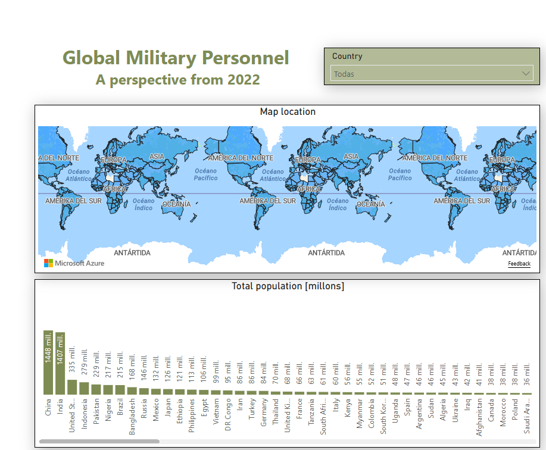
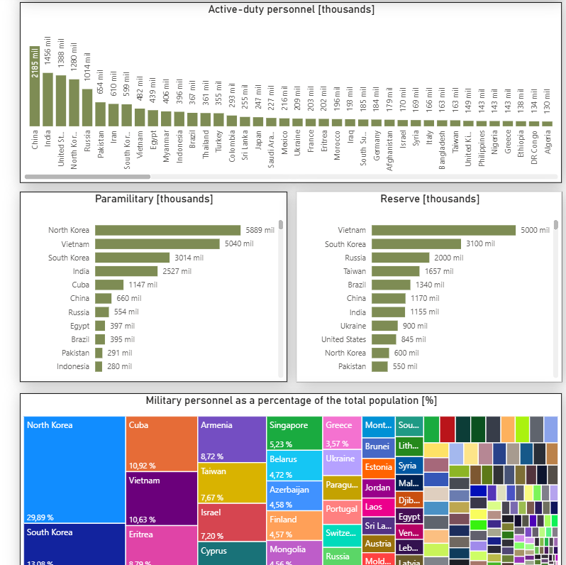

# Global Military Personnel - A perspective from 2022

This dashboard represents the military personnel for every country at 2022. It shows relevant plots for get a complete view
of the context for a nation, and even make comparisons between them.

## Dashboard
The structure looks like this.

Interact with the dashboard in the [link](https://app.powerbi.com/groups/me/reports/2c80c48b-d1b3-4391-be76-5bab2dc720e9/0d5fa7e962e020ac096e?experience=power-bi). 

Note: You may require permission for access. Ask if need it. 

The dataset can be found in this repository, and was downloaded from Kaggle [here](https://www.kaggle.com/datasets/durgeshrao9993/top-greatest-armies-of-the-world).
